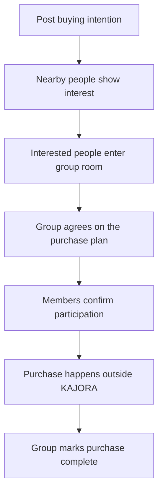

# KAJORA

**Buy together. Spend less.**

KAJORA is a location-aware community platform that helps people with similar buying intentions find one another, form a group, agree on the details, and complete a shared purchase.

The name comes from the Yoruba expression **“Ká jọ rà”** — **“let’s buy together.”**

## The problem

People often need only part of an item that is cheaper, more practical, or only available when purchased in bulk. A person may want half a cow for an event, a portion of a bag of rice, or part of a wholesale carton, but have no reliable way to find nearby people who want the remaining portions.

Existing marketplaces usually begin with a product that is already available for sale. KAJORA begins earlier—with the buyer’s intention.

> “I want part of a cow. Who nearby wants the rest?”

The person creating the post does not need to own the item, have selected a vendor, or know the final price. Interested people form a group and decide those details together.

## Product model

KAJORA supports two kinds of public posts.

### Buying intention

The primary post type. Someone describes what they want to buy and the share they may need.

Example:

> “I want half a cow for an event in Osogbo next month. I’m looking for people who want the other portions.”

The primary action is **I’m interested**.

### Available share

A secondary post type for someone who already owns, has sourced, or is ready to supply an item and wants to sell a defined portion.

Example:

> “Fifty percent of a cow is available in Ilesa for pickup this Saturday.”

The primary action is **Request this share**.

## How KAJORA works



The group room is more than a chat. It provides a structured place to agree on:

- portion sizes;
- expected budget;
- vendor or seller;
- final price;
- purchase date;
- slaughtering, processing, or packaging;
- pickup or delivery arrangements; and
- who will coordinate the purchase.

When the group reaches an agreement, a member creates a **final plan**. Every participating member can review and confirm that plan before the purchase proceeds.

## Initial launch

The first release is a supervised mobile-first pilot in **Osogbo, Osun State, Nigeria**.

Initial categories:

- livestock: cows, goats, and rams;
- foodstuff: rice, beans, garri, and produce; and
- household essentials: cooking oil and wholesale carton goods.

Livestock is the flagship category because it clearly demonstrates KAJORA’s value. Foodstuff and household essentials provide opportunities for more frequent use.

## MVP scope

### Included

- Phone-number-based account creation and sign-in
- Basic user profiles
- Location selection and nearby discovery
- Public intention wall
- Buying-intention posts
- Available-share posts
- Category and location filters
- Interest expression and withdrawal
- Group rooms
- Group discussion
- Structured decision checklist
- Final-plan proposal and member confirmation
- Notifications
- Post sharing through links and WhatsApp
- Post and user reporting
- Basic organiser and seller verification indicators
- Administrative moderation tools
- Completion feedback

### Not included in the first release

- KAJORA wallet
- Escrow or custody of pooled funds
- In-app payment processing
- Guaranteed delivery
- Nationwide launch
- Native iOS or Android applications
- AI matching or recommendations
- Loyalty points
- Complex social feeds
- Automatic vendor procurement
- Automatic determination of fair livestock portions

The first release coordinates people and decisions. Payments and fulfilment happen outside KAJORA until those workflows have been validated and an appropriate operating and compliance model is in place.

## Core experience

### Public wall

The home experience is a feed of human intentions, not a conventional product catalogue.

Example card:

> **Ade wants to share a cow**  
> Osogbo · Wants approximately one half · Next month  
> 4 people interested  
> **I’m interested**

### Group room

Once at least one other person is interested, participants can enter a room containing:

- the original intention;
- interested and confirmed members;
- conversation;
- suggestions;
- a shared decision checklist;
- the proposed final plan; and
- confirmation status.

### Final plan

A final plan records what the group has agreed to. It may include:

- selected product or animal;
- vendor;
- total cost;
- additional costs;
- portion allocation;
- amount expected from each participant;
- purchase date;
- pickup or distribution arrangement; and
- coordinator.

A final plan is not active until the required members confirm it.

## Product principles

1. **Intent before inventory** — people can seek partners before sourcing an item.
2. **Local before national** — nearby relevance matters more than a large generic catalogue.
3. **Discussion before commitment** — interest is not a financial commitment.
4. **Agreement before payment** — the group sees and approves a clear plan first.
5. **People over listings** — identity, participation, and trust are visible.
6. **Simple before comprehensive** — the MVP should make one journey work well.
7. **Privacy by default** — precise addresses and private contact information are not public.

## User roles

| Role | Description |
| --- | --- |
| Member | Discovers posts, shows interest, joins discussions, and confirms plans |
| Creator | Publishes a buying intention or available share |
| Coordinator | Helps the group turn its decisions into a final plan |
| Seller | Offers an available share or supplies an item selected by a group |
| Administrator | Moderates users and content, reviews reports, and manages categories and locations |

A creator is not automatically a seller or permanent coordinator.

## Lifecycle summary

| State | Meaning |
| --- | --- |
| Open | The post is public and accepting interest |
| Forming | People have shown interest but the group is not ready to plan |
| Planning | Members are discussing requirements and suppliers |
| Awaiting confirmation | A final plan has been proposed |
| Confirmed | Required members have accepted the final plan |
| Completed | The group reports that the purchase was completed |
| Closed | The post expired, was cancelled, or ended without a purchase |

Detailed transitions and permissions are defined in [docs/PRODUCT_SPEC.md](docs/PRODUCT_SPEC.md).

## Design direction

KAJORA should feel calm, human, local, and trustworthy.

- Warm ivory background
- Deep moss green primary colour
- Charcoal text
- Restrained muted-earth accent
- Humanist sans-serif typography
- Generous whitespace
- Authentic, naturally lit photographs
- Minimal iconography
- One clear primary action per screen

Avoid gradients, glass effects, 3D illustrations, excessive badges, generic fintech styling, and decorative elements that compete with the user’s intention.

## Technical stack

The first application is built with:

- Expo SDK 57 and React Native 0.86;
- TypeScript in strict mode;
- Expo Router for Android, iOS, and web navigation;
- a small custom KAJORA component system;
- PostgreSQL and Supabase as the persistence target;
- Supabase Realtime for group updates;
- PostGIS for later proximity queries; and
- Expo Notifications and EAS for later device delivery and builds.

The application should support:

- mobile-first responsive UI;
- secure phone authentication;
- relational data and transactional consistency;
- location-based queries without exposing precise public coordinates;
- real-time or near-real-time group updates;
- background notifications;
- moderation and audit history;
- image upload and optimisation;
- accessible interfaces; and
- reliable operation on modest devices and constrained networks.

The architecture decision and integration sequence are documented in [docs/ARCHITECTURE.md](docs/ARCHITECTURE.md).

## Working prototype

The repository now contains a functional alpha vertical slice:

- Supabase email-and-password authentication for the closed alpha;
- persistent demo authentication when Supabase is not configured;
- first-profile setup and persisted sessions;
- protected application routes;
- cross-platform bottom-navigation symbols;
- public intention wall;
- search and category filtering;
- intention details;
- persisted buying intentions;
- persisted interest expression and withdrawal;
- automatic group creation when another member shows interest;
- member-only active groups;
- structured group decisions and conversation;
- persisted group messages;
- new-intention publishing; and
- a basic profile and trust-language screen.

Supabase environment variables are required for sign-in. Missing configuration blocks authentication; demo sessions are no longer restored.

With Supabase configured, the app uses email-and-password accounts and shared cloud data, so two people can complete the end-to-end alpha journey. Phone OTP remains the intended public-launch authentication method once an appropriate Nigerian SMS provider is available.

### Run locally

```bash
npm install
npm run start
```

Other useful checks:

```bash
npm run typecheck
npm run build:web
```

## Connect Supabase

KAJORA never needs a Supabase service-role key in the app. Only use the public project URL and publishable key.

1. Create a Supabase project.
2. Open the Supabase SQL editor and run these files in order:
   - `supabase/migrations/202609260001_initial_schema.sql`
   - `supabase/migrations/202609280001_alpha_helpers.sql`
   - `supabase/migrations/202610050001_join_approval.sql`
3. In Supabase Authentication, enable the Email provider and set a minimum password length of at least eight characters.
4. For a closed alpha without an email delivery provider, create the test users in Authentication > Users and keep public sign-ups disabled. Do not disable email confirmation for a public launch.
5. Copy the environment template:

```bash
cp .env.example .env.local
```

6. Replace the placeholders in `.env.local`:

```dotenv
EXPO_PUBLIC_SUPABASE_URL=https://your-project.supabase.co
EXPO_PUBLIC_SUPABASE_PUBLISHABLE_KEY=your-publishable-key
```

7. Restart Expo after changing environment variables:

```bash
npm run start
```

For a Vercel deployment, add the same two environment variables in the project settings and redeploy. Do not commit `.env.local`.

### Alpha test script

Use two separate email accounts or devices:

1. Sign in as person A, finish the profile, and publish a buying intention.
2. Sign out, then sign in as person B.
3. Open person A’s intention and tap **I’m interested**.
4. KAJORA creates the group automatically and opens its room.
5. Send a group message as person B.
6. Sign back in as person A and open **Groups** to see the same group and conversation.

Interest is non-binding, and KAJORA does not collect or hold purchase funds in this alpha.

## Success measures for the pilot

- Percentage of intentions receiving at least one interested person
- Time to first interest
- Percentage of groups reaching a final plan
- Percentage of final plans confirmed by all required participants
- Percentage of confirmed plans marked completed
- Member withdrawal rate
- Report and dispute rate
- Repeat participation
- Qualitative feedback from completed groups

The primary pilot metric is the percentage of buying intentions that result in a completed shared purchase.

## Documentation

- [Product specification](docs/PRODUCT_SPEC.md)
- [Technical architecture](docs/ARCHITECTURE.md)

Future project documentation may include:

- architecture decisions;
- database model;
- API contract;
- design system;
- moderation handbook;
- pilot operations playbook; and
- deployment guide.

## Current status

**Persistent multi-user alpha with Supabase email accounts.**

The account onboarding flow, intent-first model, visual system, main screens, persisted demo mode, Supabase authentication, database persistence, automatic group creation, and group conversation are implemented. Phone verification remains on the roadmap for the public pilot once a suitable SMS provider is available.

See [Approved membership rollout](docs/JOIN_APPROVAL.md) for organiser approval, optional total group sizes, migration order, and the three-account privacy test.
